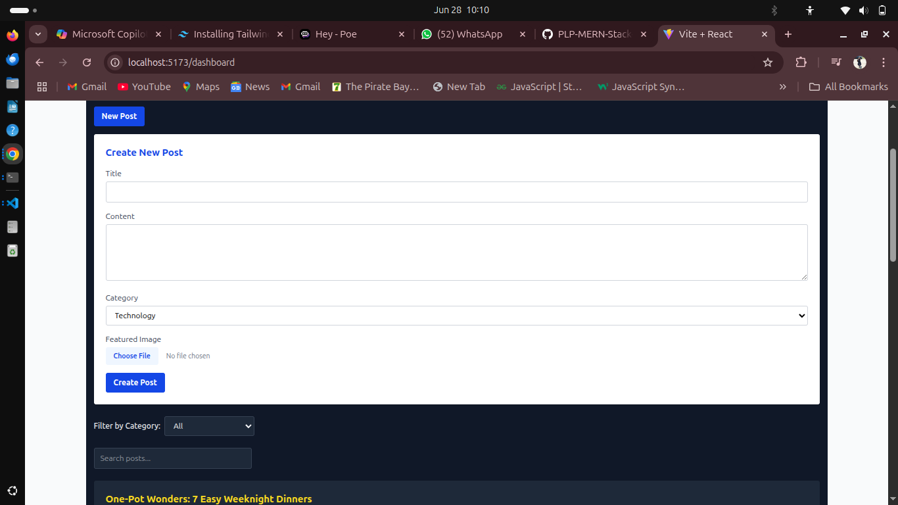
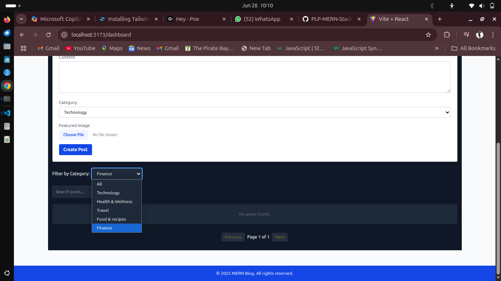

```markdown
# 📝 BlogSphere – A MERN Stack Blogging Platform

BlogSphere is a full-stack blogging platform built with the MERN stack (MongoDB, Express, React, Node.js). It allows users to create, categorize, and manage blog posts with a clean dashboard interface, secure authentication, and dynamic content rendering.

---

## 🚀 Project Overview

This app enables seamless blog publishing, category management, and content exploration. It includes:

- **JWT-based user authentication**
- **Category management system**
- **Post creation with title, content, and category**
- **RESTful API with robust error handling**
- **Client-side routing and data fetching with Axios**
- **Multer integration for image upload (optional)**

---

## 📷 Screenshots

### 📝 New Post Form
![Screenshots/newPost.png]


### 📂 Category Management
![Screenshots/categoryManagement.png]


---

## 🔧 Setup Instructions

### 1. Clone the Repository
```bash
git clone https://github.com/PLP-MERN-Stack-Development/week-4-mern-integration-assignment-Miss-Maggie.git
cd week-4-mern-integration-assignment-Miss-Maggie
```

### 2. Server Setup
```bash
cd server
pnpm install
```
Create a `.env` in the `server/` directory:
```env
MONGO_URI=your_mongodb_connection_string
JWT_SECRET=your_jwt_secret
PORT=5000
```

Start the server:
```bash
pnpm dev
```

### 3. Client Setup
```bash
cd ../client
pnpm install
pnpm start
```

---

## 📮 API Documentation

### 🔐 /api/auth
| Method | Endpoint     | Description       |
|--------|--------------|-------------------|
| POST   | `/register`  | Create a user     |
| POST   | `/login`     | User login & JWT  |

### 📂 /api/categories
| Method | Endpoint | Description         |
|--------|----------|---------------------|
| GET    | `/`      | Fetch all categories|
| POST   | `/`      | Create category     |

### 📝 /api/posts
| Method | Endpoint | Description       |
|--------|----------|-------------------|
| GET    | `/`      | Fetch all posts   |
| POST   | `/`      | Create new post   |

---

## 🎯 Features Implemented

- 🔐 JWT Authentication
- 🗂️ Category Management
- 📝 Post Creation with Category Tags
- 🌐 RESTful API Integration
- 📡 Axios-Based Fetching
- 💬 Express Validator Middleware
- 🖼️ Screenshots Support for Visual Docs

---

## 🧠 Author

Built with care by [Magdaline](https://github.com/Miss-Maggie)  
Developed under the PLP MERN Stack program 🌱

---

## 🛡️ License

This project is licensed under the [MIT License](./LICENSE)
```

---

When you’re ready, just drop your screenshots into a `/screenshots` folder, and they’ll light up your readme perfectly! Let me know if you want badges, a live demo link, or markdown styling touch-ups. We’re polishing this like a pro portfolio piece ✨